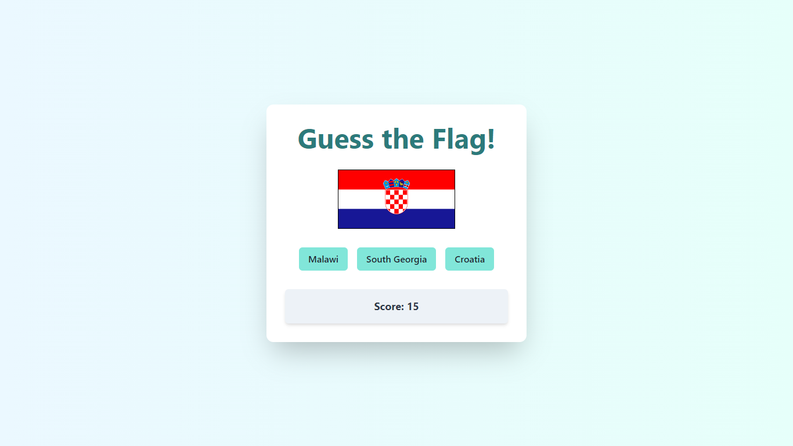

# 🌍 Flag Quiz - Guess the Flag Game

Este é um jogo interativo de adivinhar bandeiras, desenvolvido com **ReactJS** e **TypeScript**, e estilizado com **Chakra UI**. O objetivo do jogo é testar seus conhecimentos sobre as bandeiras de diferentes países do mundo, oferecendo uma experiência divertida e educativa.

## 🎮 Funcionalidades

- Apresenta uma bandeira aleatória e oferece três opções de países para adivinhar.
- Exibe o placar conforme você acerta ou erra as respostas.
- Feedback visual instantâneo com mensagens amigáveis sobre a resposta correta.
- Design moderno e responsivo, com layout estilizado usando Chakra UI.

## 🛠️ Tecnologias Utilizadas

- **ReactJS**: Biblioteca JavaScript para criação de interfaces de usuário.
- **TypeScript**: Superset de JavaScript com tipagem estática.
- **Chakra UI**: Biblioteca de componentes de UI para React, proporcionando um design limpo e consistente.
- **REST API**: Utilizada para buscar informações sobre bandeiras e países.
  
## 🚀 Instalação e Execução

Siga os passos abaixo para executar a aplicação localmente:

1. Clone o repositório:
   ```bash
   git clone https://github.com/Grazziano/flag-quiz.git
   ```

2. Navegue até o diretório do projeto:
   ```bash
   cd flag-quiz
   ```

3. Instale as dependências do projeto:
   ```bash
   npm install
   ```

4. Inicie o servidor de desenvolvimento:
   ```bash
   npm start
   ```

5. Abra [http://localhost:3000](http://localhost:3000) para visualizar no navegador.

## 📂 Estrutura do Projeto

```
guess-the-flag/
│
├── public/                # Arquivos públicos
├── src/                   # Código fonte da aplicação
│   ├── components/        # Componentes reutilizáveis
│   ├── utils/             # Funções auxiliares
│   ├── types/             # Definições de tipos do TypeScript
│   ├── App.tsx            # Componente principal
│   └── index.tsx          # Entrada do React
│
├── README.md              # Documentação do projeto
├── package.json           # Dependências e scripts do projeto
└── tsconfig.json          # Configurações do TypeScript
```

## 🖥️ Demonstração



## 🤔 Como Jogar

1. Clique no botão correspondente ao país que você acha que corresponde à bandeira exibida.
2. Ao acertar, o placar aumentará em 1 ponto.
3. Ao errar, você verá a resposta correta, e uma nova bandeira será exibida para continuar jogando.

## 🌟 Funcionalidades Futuras

- Sistema de níveis de dificuldade (fácil, médio, difícil).
- Integração com API para mais dados sobre os países.
- Ranking global para comparação de pontuações entre jogadores.

## 📝 Licença

Este projeto está licenciado sob a [MIT License](LICENSE).
